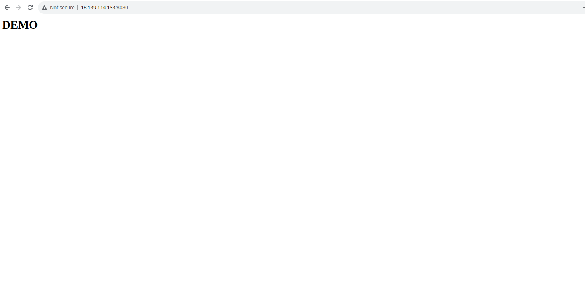

# How to run

- Intall docker
```
sudo dnf update
sudo dnf install docker
sudo systemctl start docker
sudo systemctl enable docker
sudo systemctl status docker

sudo curl -L https://github.com/docker/compose/releases/latest/download/docker-compose-$(uname -s)-$(uname -m) -o /usr/local/bin/docker-compose
sudo chmod +x /usr/local/bin/docker-compose
docker-compose version
```

- Intall git
```
sudo yum install git
```

- Run docker compose
```
sudo git clone https://github.com/danhbuidcn/exam_cicd.git
cd exam_cicd
sudo git checkout dev
sudo docker-compose up -d
```

