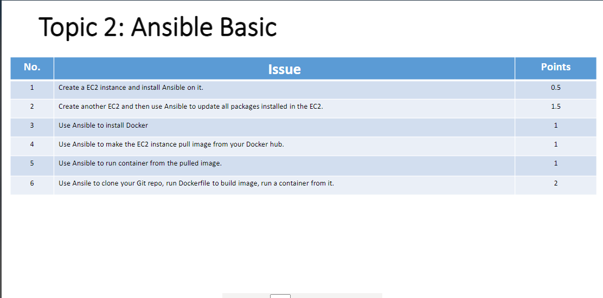

# Purpose




# Problem solve 

B1:
Tạo 2 ec2. gán key_pair, gán SG (allow ssh), gán role (policies: AmazonSSMManagedInstanceCore)
- 1 EC2 làm máy chủ cài ansible (master)
- 1 EC2 làm máy ảo  để demo việc cài đặt package, software bằng ansible (slave)


B2: 
tại ec2 master 

```
$ sudo yum update
$ sudo yum install software-properties-common
$ sudo add-yum-repository --yes --update ppa:ansible/ansible
$ sudo yum install ansible
```
